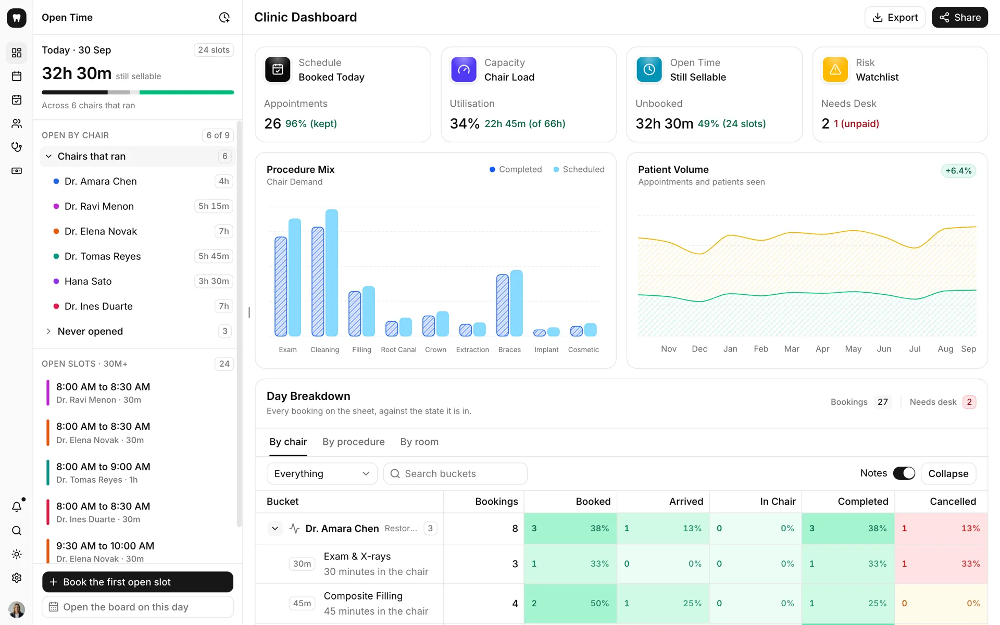
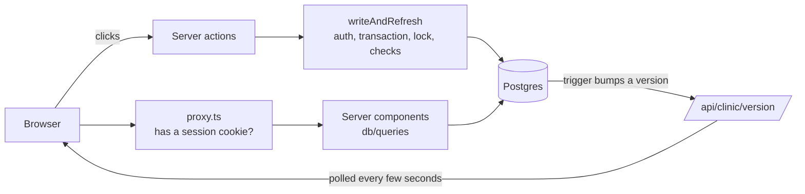

# Floss

The front desk of a dental practice. Calendar, patients, insurance, recall, treatment plans, staff and billing,
all running on Postgres and updating live across tabs.

**Demo:** [floss-dental-demo.vercel.app](https://floss-dental-demo.vercel.app) (one tap signs you in as Dana, the practice
manager)



When you sign in it's 11:24 AM at a nine-chair practice: thirteen visits done, three people in the chair, eight
still to come. The clock keeps running from there. Move a booking, check someone in, verify their benefits, take a
payment, and it saves to the database and shows up in any other open tab a few seconds later.

> Everything is fake. The practice, its 117 patients, the staff and every visit come from the seed, and the
> portraits are generated. No real patient data, ever.

## What's in it

| Page         | What you can do                                                                                          |
| ------------ | -------------------------------------------------------------------------------------------------------- |
| Dashboard    | Today's numbers, chair load, open slots, procedure mix, and a breakdown of the day by chair or procedure |
| Calendar     | Day view by provider or by operatory, week view, drag to move or resize, a log of every change           |
| Appointments | Everything that isn't chair time: insurance calls, recalls, meetings, in month, week, day and agenda     |
| Patients     | A filterable grid of every patient with their recall and benefits status; each opens a full sheet        |
| Staff        | Today's visits as a board with a lane per clinician; drag a visit to hand it off                         |
| Payments     | An invoice ledger built from finished visits, with CDT codes, ageing and a new invoice wizard            |
| Settings     | Profile, hours, chairs, the fee schedule, billing terms, notifications                                   |

Search is ⌘K from anywhere, **D** flips light and dark, and it works on a phone.

### The dental stuff

| Feature         | How it works                                                                                              |
| --------------- | --------------------------------------------------------------------------------------------------------- |
| CDT codes       | Every procedure has its code (D0120 exam, D1110 cleaning, D2740 crown…) on bookings, invoices and fees    |
| Insurance       | Each patient has a carrier and member ID; benefits checked more than 30 days ago need a re-verify         |
| Recall          | Cleanings every 6 months (3 for perio). Finishing a cleaning resets it                                    |
| Treatment plans | Procedures by tooth, what insurance should cover (100/80/50) and what the patient owes; accept or decline |
| Operatories     | The calendar can show the day by room instead of by provider, and you can drag a visit between rooms      |

## How it works



A few things I'm happy with:

- **Every write goes through one function.** It checks the session, opens a transaction, takes a lock, runs the
  checks (no booking on top of lunch, no duplicate chart numbers), writes, and refreshes. If something's not allowed
  you get a message back instead of an error.
- **Live updates with no websockets.** A trigger bumps a version number on every write, and open pages only
  re-render when it changes.
- **One timezone.** All dates go through `src/lib/dates.ts` in the practice's time (Denver), so the server in UTC
  and someone in Tokyo see the same 8:30 AM. The tests run in UTC to make sure.
- **A seed that makes sense.** Specialists work their own days in their own rooms, patients are on real care plans
  (root canal then crown, braces adjustments, implant stages), and a test checks nobody gets double booked.
- **It resets itself** every day, so whatever people click on the demo is gone tomorrow.

## Stack

| Layer   | What I used                                                                     |
| ------- | ------------------------------------------------------------------------------- |
| App     | Next.js 16 (App Router, server actions, React Compiler), React 19, TypeScript 7 |
| UI      | Tailwind 4, shadcn/ui on Base UI, Recharts                                      |
| Data    | Postgres, Drizzle, next-safe-action, Zod                                        |
| Auth    | Better Auth                                                                     |
| Testing | Vitest on a real database, Playwright with axe, Oxlint, Knip                    |
| Hosting | Vercel and Neon                                                                 |

## Running it

You need Node 24, pnpm 10 and Postgres ([Postgres.app](https://postgresapp.com) on a Mac).

```bash
pnpm bootstrap   # installs, makes .env.local and the database, migrates and seeds
pnpm dev         # http://localhost:3001
```

| Command         | What it does                                              |
| --------------- | --------------------------------------------------------- |
| `pnpm check`    | Types, lint, formatting, unused code and unit tests       |
| `pnpm test:e2e` | Every page on desktop and phone with accessibility checks |
| `pnpm db:seed`  | Starts the practice over                                  |

Deploying is Vercel plus Neon; the steps are in [docs/deployment.md](docs/deployment.md).

## Security and accessibility

Sign-in is Better Auth with hashed passwords, database sessions and rate limiting. Every query and action checks the
session itself, not just the proxy. A real clinic would need a lot more (HIPAA, BAAs, per-person accounts, audit
logs, MFA), which is why nothing real goes in here.

Every page passes axe in light and dark on desktop and phone, and anything you can drag you can also do from a menu.
