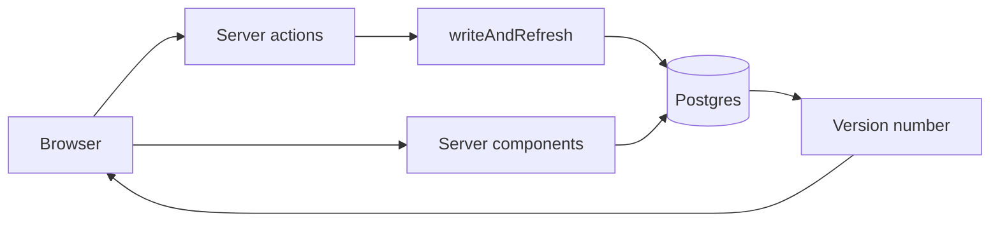

# Floss

The front desk for a dental practice: the schedule, patients, insurance, treatment plans, staff and payments.

**Demo:** [floss-dental-demo.vercel.app](https://floss-dental-demo.vercel.app) (one tap signs you in as Dana, the
practice manager)


When you sign in it's 11:24 AM at a nine-chair practice. Thirteen visits are done, three people are in the chair and
eight are still to come, and the clock keeps going from there. Move a booking, check someone in or take a payment, and
it saves to Postgres and shows up in any other open tab a few seconds later.

> Everything is made up: the practice, its 117 patients, the staff and every visit. No real patient data.

## What's in it

| Page         | What you can do                                                                          |
| ------------ | ---------------------------------------------------------------------------------------- |
| Dashboard    | Today's numbers, chair load, open slots and a breakdown of the day by chair or procedure |
| Calendar     | Day view by provider or by room, week view, drag to move or resize a visit               |
| Appointments | Everything that isn't chair time: insurance calls, recalls, meetings                     |
| Patients     | Every patient with their recall and benefits status; each one opens a full chart         |
| Staff        | Today's visits with a lane per clinician; drag a visit to hand it off                    |
| Payments     | Invoices from finished visits with CDT codes, ageing and a new invoice wizard            |
| Settings     | Profile, hours, chairs, the fee schedule and billing terms                               |

It also has the dental basics: CDT codes on every procedure, insurance that needs re-verifying after 30 days,
cleanings every 6 months, and treatment plans that show what insurance covers and what the patient owes. ⌘K searches
everything, **D** flips light and dark, and it works on a phone.

## How it works



- **Every write goes through one function.** It checks the session, opens a transaction, runs the checks (no booking
  on top of lunch, no duplicate chart numbers), saves, and refreshes the page. If something isn't allowed you get a
  message back, not an error.
- **Live updates without websockets.** A trigger bumps a version number on every write, and open tabs only reload
  when it changes.
- **One timezone.** Dates all go through `src/lib/dates.ts` in the practice's time, so a server in UTC and someone in
  Tokyo both see 8:30 AM. The tests run in UTC to prove it.
- **It resets every day**, so whatever people click on the demo is gone tomorrow.

## Stack

| Layer   | What I used                                                     |
| ------- | --------------------------------------------------------------- |
| App     | Next.js 16 (App Router, React Compiler), React 19, TypeScript 7 |
| UI      | Tailwind 4, shadcn/ui on Base UI, Recharts                      |
| Data    | Postgres, Drizzle, next-safe-action, Zod                        |
| Auth    | Better Auth                                                     |
| Testing | Vitest on a real database, Playwright with axe, Oxlint, Knip    |
| Hosting | Vercel and Neon                                                 |

## Running it

You need Node 24, pnpm 10 and Postgres ([Postgres.app](https://postgresapp.com) on a Mac).

```bash
pnpm bootstrap   # installs, makes .env.local and the database, migrates and seeds
pnpm dev         # http://localhost:3001
```

| Command         | What it does                                              |
| --------------- | --------------------------------------------------------- |
| `pnpm check`    | Types, lint, formatting, unused code and unit tests       |
| `pnpm test:e2e` | Every page on desktop and phone with accessibility checks |
| `pnpm db:seed`  | Starts the practice over                                  |

Deploying is in [docs/deployment.md](docs/deployment.md).

## Security and accessibility

Sign-in is Better Auth with hashed passwords, database sessions and rate limiting, and every query checks the session
itself. A real clinic would need a lot more (HIPAA, audit logs, MFA), which is why nothing real goes in here.

Every page passes axe in light and dark on desktop and phone, and anything you can drag you can also do from a menu.
